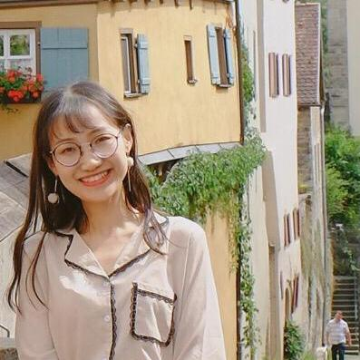

## Welcome to JiaojiaoYe Pages

I'm currently pursuing my master degree at Eletrical and Computer Engineering Department, Technical University of Munich, Germany. At the same time, now I'm doing a Internship about Perception based on GAN technique at Robert Bosch GmbH.

Before this, 2016 I got my Bachelor of Engineer at Zhejiang University in China. Through different lectures and projects, I have obtained the chance to be exposed to the field of artificial intelligence, robotics, data analysis and computer vision. I am particularly keen to do some research on the application of artificial intelligence, especially the combination of Robotics and Artificial Intelligence.

**Email:** jiaojiao.ye@tum.de

[GitHub](https://github.com/JiaojiaoYe1994) | [Linkedin](https://www.linkedin.com/in/jiaojiao-ye-99830b14a/)

### Research Interest
* **Machine Learning**: Generative Model, Reinforcement Learning, Feature Representation, Classification, High Dimension Reduction
* **Robotics**: Trajectory Planning, Motion Control
* **Computer Vision**: Image Synthesis, Image Manipulation

### Projects
* **Motion Planning with Reinforcement Learning** 

Poppy Humanoid robot reaching Movement Learning with Deep Deterministic Policy Gradient(DDPG).

[project](https://jiaojiaoye1994.github.io/jiaojiaoye.github.com/posts/motion_learning_with_rl) | [video](https://youtu.be/oOG4bsWDT0M) | [github](https://github.com/JiaojiaoYe1994/Robot-Motion-Learning-with-Reinforcement-Learning)

### Tutorial
* **CS231n's Assignments** 

I've worked througn Stanford's Convolutional Neural Networks for Visual Recognition course [cs231n](http://cs231n.stanford.edu), which is a wonderful lecture for diving into Deep Learning. [Here](https://github.com/JiaojiaoYe1994/cs231_assignment_solution1718) find out my solution for assignments.

### Publications
* A Generative Map for Image-based Camera Localization. Mingpan Guo, Stefan Matthes, Jiaojiao Ye and Hao Shen, 2019, under review

### Hobbies
[Travel](https://jiaojiaoye1994.github.io/jiaojiaoye.github.com/posts/travel/travel) | [Dance](https://jiaojiaoye1994.github.io/jiaojiaoye.github.com/posts/dance/dance)
